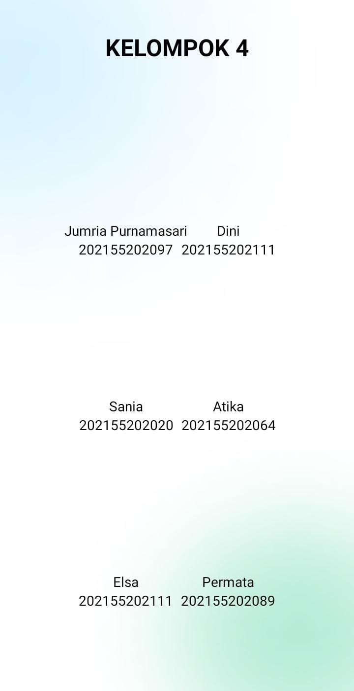

# Sistem_Cerdas
## Tampilan Aplikasi 🌱

  <figure style="margin-bottom: 20px; text-align: center;">
    
  </figure>
  
  <figure style="margin-right: 20px; text-align: center;">
    
  </figure>
  
  <figure style="text-align: center;">
    
  </figure>
  
  <figure style="text-align: center;">
    
  </figure>
  
  <figure style="text-align: center;">
    
  </figure>

